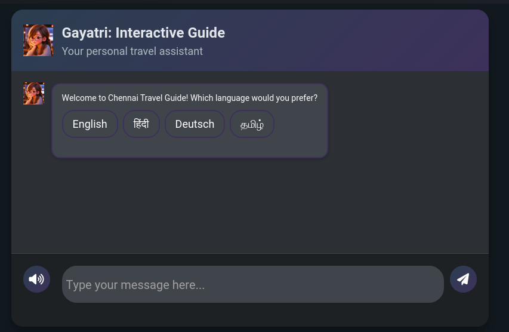

View instructions in the end.

<h1>Gayatri: Interactive Guide </h1>

<strong>Welcome to our project: Gayatri <strong>, your personal assistant to explore Chennai, one of India's most vibrant cities. Whether you're a curious traveler, a history enthusiast, or a cultural explorer, LandmarkLens is here to make your journey unforgettable!

<h2>Real-World Problems We Solve:</h2>

<h3>1. Lack of Information on Local Attractions</h3>

Exploring a new city or landmark without context can be frustrating. <strong>LandmarkLens</strong> offers travelers <strong>instant information</strong> about local attractions, from historical facts to architectural features.

<h3>2. Understanding Historical & Cultural Context</h3>

Every landmark has a story to tell, but <strong>without understanding its historical and cultural significance</strong>, it’s just another building or statue.

<h3>3. Overcoming Language Barriers</h3>

With <strong>LandmarkLens</strong>, language is never a barrier. The chatbot supports multiple languages and instantly translates the local history and culture.

<h3>4. Reducing Dependency on Human Guides</h3>

<strong>LandmarkLens</strong> empowers you to explore independently, with a virtual guide in your pocket. Get detailed information, suggested itineraries, and answers to all your questions, whenever you need them.

<h2>Key Features of LandmarkLens:</h2>
<ul>
    <li><strong>Multilingual Support</strong>: Break down language barriers with support for multiple languages.</li>
    <li><strong>Interactive Voice Output</strong>: Ask questions and get answers in real time by typing </li>
    <li><strong>Personalized Travel Recommendations</strong>: Get customized itineraries based on your interests and preferences.</li>
    <li><strong>Engaging Content</strong>: Enjoy fun facts, history lessons, and cultural stories that make each site come alive.</li>
    <li><strong>Seamless Experience</strong>: Whether you’re a solo traveler, a family, or part of a group, LandmarkLens adapts to your needs.</li>
</ul>

<h2>Why Choose LandmarkLens?</h2>

<strong>LandmarkLens</strong> offers <strong>instant, interactive</strong>, and <strong>multilingual assistance</strong> right at your fingertips.

<em>Get Started Now:</em> Ready to begin your journey? Download <strong>LandmarkLens</strong> today and unlock the hidden stories and secrets of the world’s most iconic landmarks.

=========================================================================================
This is the error we were getting while we were pushing our code 
Error: InvalidCharacterError: Failed to execute 'btoa' on 'Window': The string to be encoded contains characters outside of the Latin1 range.
we submitted it as a normal html and js file which are main.js and main.html

WE ARE FACING SOME ERRORS WHILE PUSHING THE CODE TO GITHUB THE ERROR SAYS:

Error: InvalidCharacterError: Failed to execute 'btoa' on 'Window': The string to be encoded contains characters outside of the Latin1 range.

================================================================================================================================ 
INSTRUCTION:
-RUN IN GOOGLE CHROME; 
-double tap the speaker button and wait for the response the speaker icon must turn red 
-just wait a few seconds if it is not responding there might be a delay

we have tried multiple times now so its working 😅

